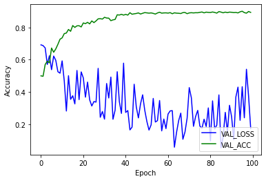

```
import numpy as np
import keras
from keras.models import Model
from keras.layers import Flatten, Dense, Input, Conv2D, MaxPooling2D
from tensorflow.keras.preprocessing.image import ImageDataGenerator #데이터 Augmentation, 하면 좋은거임
```


```
def VGG16_Brief(classes=2): # classes = 감지할 클래스 수
    img_rows, img_cols = 224, 224
    img_channels = 3    
    img_dim = (img_rows, img_cols, img_channels) #차원..shape 정의..
    
    img_input = Input(shape=img_dim) #튜플.. 변경 x
    x = Conv2D(64,(3,3),padding='same',activation = 'relu')(img_input) #1층
    x = Conv2D(64,(3,3),padding='same',activation = 'relu')(x) #2층
    x = MaxPooling2D((2,2),strides=(2,2))(x) #2층 maxpool

    x = Conv2D(128,(3,3),padding='same',activation = 'relu')(x) #3층
    #x = Conv2D(128,(3,3),padding='same',activation = 'relu')(x) #4층
    x = MaxPooling2D((2,2),strides=(2,2))(x) #4층 maxpool

    x = Conv2D(256,(3,3),padding='same',activation = 'relu')(x) #5층
    #x = Conv2D(256,(3,3),padding='same',activation = 'relu')(x) #6층
    x = Conv2D(256,(3,3),padding='same',activation = 'relu')(x) #7층
    x = MaxPooling2D((2,2),strides=(2,2))(x) #7층 maxpool

    #x = Conv2D(512,(3,3),padding='same',activation = 'relu')(x) #8층
    #x = Conv2D(512,(3,3),padding='same',activation = 'relu')(x) #9층
    #x = Conv2D(512,(3,3),padding='same',activation = 'relu')(x) #10층
    #x = MaxPooling2D((2,2),strides=(2,2))(x) #10층 maxpool

    #x = Conv2D(512,(3,3),padding='same',activation = 'relu')(x) #11층
    #x = Conv2D(512,(3,3),padding='same',activation = 'relu')(x) #12층
    #x = Conv2D(512,(3,3),padding='same',activation = 'relu')(x) #13층
    #x = MaxPooling2D((2,2),strides=(2,2))(x) #13층 maxpool

    x = Flatten()(x)
    x = Dense(256, activation = 'relu')(x) #14층
    x = Dense(256, activation = 'relu')(x) #15층
    x = Dense(classes, activation = 'softmax')(x)
    
    model = Model(inputs=img_input, output = x)
    return model
```


```
model = VGG16_Brief(classes = 2)
model.summary()
```

    Model: "model_2"
    _________________________________________________________________
    Layer (type)                 Output Shape              Param #   
    =================================================================
    input_2 (InputLayer)         (None, 224, 224, 3)       0         
    _________________________________________________________________
    conv2d_6 (Conv2D)            (None, 224, 224, 64)      1792      
    _________________________________________________________________
    conv2d_7 (Conv2D)            (None, 224, 224, 64)      36928     
    _________________________________________________________________
    max_pooling2d_4 (MaxPooling2 (None, 112, 112, 64)      0         
    _________________________________________________________________
    conv2d_8 (Conv2D)            (None, 112, 112, 128)     73856     
    _________________________________________________________________
    max_pooling2d_5 (MaxPooling2 (None, 56, 56, 128)       0         
    _________________________________________________________________
    conv2d_9 (Conv2D)            (None, 56, 56, 256)       295168    
    _________________________________________________________________
    conv2d_10 (Conv2D)           (None, 56, 56, 256)       590080    
    _________________________________________________________________
    max_pooling2d_6 (MaxPooling2 (None, 28, 28, 256)       0         
    _________________________________________________________________
    flatten_2 (Flatten)          (None, 200704)            0         
    _________________________________________________________________
    dense_4 (Dense)              (None, 256)               51380480  
    _________________________________________________________________
    dense_5 (Dense)              (None, 256)               65792     
    _________________________________________________________________
    dense_6 (Dense)              (None, 2)                 514       
    =================================================================
    Total params: 52,444,610
    Trainable params: 52,444,610
    Non-trainable params: 0
    _________________________________________________________________
    

    C:\Users\notou\Anaconda3\envs\tf_gpu_10\lib\site-packages\ipykernel_launcher.py:35: UserWarning: Update your `Model` call to the Keras 2 API: `Model(inputs=Tensor("in..., outputs=Tensor("de...)`
    


```
model.compile(optimizer=keras.optimizers.Adam(learning_rate=0.0003), 
              loss='categorical_crossentropy', metrics=['accuracy'])
```


```
#데이터 증강.. dataset이 적을 떄 overfitting 방지
training_dir='C://dataset//data_10000'
validation_dir='C://dataset//valid_1000_v2'


train_datagen = ImageDataGenerator(
rescale=1./255, #normalization 이미지 픽셀 값이 1/225를 곱해준다. default = 1
shear_range=0.2,#반시계 방향 밀리기
zoom_range=0.2, #줌
horizontal_flip=True #인풋을 무작위로 가로로 뒤집기
)

test_datagen = ImageDataGenerator(rescale = 1./255)

training_set = train_datagen.flow_from_directory( #폴더 형태로된 데이터 구조 바로 가저옴
                                                    #이 데이터 불러올 떄 앞에 정의한 파라미터로 전처리
training_dir,
target_size=(224,224), #폴더 내 이미지 사이즈 조정
batch_size=32,  #32장씩 읽어들임
#shuffle=True,
class_mode='categorical' #2D one-hot 인코딩된 라벨 반환
)

validation_set = test_datagen.flow_from_directory(
validation_dir,
target_size = (224, 224),
batch_size=32,
class_mode = 'categorical'    
)
```

    Found 20000 images belonging to 2 classes.
    Found 2000 images belonging to 2 classes.
    


```
#learnung rate 조정 필요할 시 조정해주는 code
from tensorflow.keras.callbacks import EarlyStopping, ReduceLROnPlateau
learning_rate_reduction = ReduceLROnPlateau(monitor='val_accuracy', 
                                            patience=5, 
                                            verbose=1, 
                                            factor=0.1, 
                                            min_lr=0.00001)
```


```
history = model.fit_generator(training_set,
                   steps_per_epoch=100, #에포크 한 번 돌떄, 데이터를 몇 번 볼것인가(training데이터수/배치사이즈)
                   epochs = 100,
                   validation_data= validation_set,
                   callbacks=[learning_rate_reduction],
                   validation_steps = 100 #한 번 에포크를 돌고난 후, validation set을 통해 validation 
                                         #accuracy를 측정할 때 validation set을 몇 번 볼것인가(valdation data/batch size)
                   )
```

    Epoch 1/100
    100/100 [==============================] - 63s 628ms/step - loss: 0.7020 - accuracy: 0.4925 - val_loss: 0.6920 - val_accuracy: 0.5000
    Epoch 2/100
    100/100 [==============================] - 57s 568ms/step - loss: 0.6926 - accuracy: 0.5166 - val_loss: 0.6875 - val_accuracy: 0.4972
    Epoch 3/100
    100/100 [==============================] - 56s 557ms/step - loss: 0.6875 - accuracy: 0.5441 - val_loss: 0.6729 - val_accuracy: 0.5704
    Epoch 4/100
    100/100 [==============================] - 56s 564ms/step - loss: 0.6728 - accuracy: 0.5894 - val_loss: 0.5707 - val_accuracy: 0.5906
    Epoch 5/100
    100/100 [==============================] - 55s 554ms/step - loss: 0.6665 - accuracy: 0.6050 - val_loss: 0.6246 - val_accuracy: 0.5807
    Epoch 6/100
    100/100 [==============================] - 55s 549ms/step - loss: 0.6539 - accuracy: 0.6069 - val_loss: 0.5381 - val_accuracy: 0.6723
    Epoch 7/100
    100/100 [==============================] - 45s 450ms/step - loss: 0.6378 - accuracy: 0.6475 - val_loss: 0.6226 - val_accuracy: 0.6461
    Epoch 8/100
    100/100 [==============================] - 44s 437ms/step - loss: 0.6371 - accuracy: 0.6456 - val_loss: 0.5959 - val_accuracy: 0.6668
    Epoch 9/100
    100/100 [==============================] - 45s 449ms/step - loss: 0.6070 - accuracy: 0.6781 - val_loss: 0.5255 - val_accuracy: 0.6954
    Epoch 10/100
    100/100 [==============================] - 44s 440ms/step - loss: 0.5701 - accuracy: 0.6997 - val_loss: 0.5164 - val_accuracy: 0.7271
    Epoch 11/100
    100/100 [==============================] - 46s 456ms/step - loss: 0.5590 - accuracy: 0.7166 - val_loss: 0.5927 - val_accuracy: 0.7355
    Epoch 12/100
    100/100 [==============================] - 44s 440ms/step - loss: 0.5263 - accuracy: 0.7387 - val_loss: 0.4693 - val_accuracy: 0.7617
    Epoch 13/100
    100/100 [==============================] - 44s 438ms/step - loss: 0.5181 - accuracy: 0.7387 - val_loss: 0.2817 - val_accuracy: 0.7654
    Epoch 14/100
    100/100 [==============================] - 46s 460ms/step - loss: 0.5012 - accuracy: 0.7484 - val_loss: 0.5007 - val_accuracy: 0.7876
    Epoch 15/100
    100/100 [==============================] - 43s 429ms/step - loss: 0.4843 - accuracy: 0.7616 - val_loss: 0.3542 - val_accuracy: 0.7761
    Epoch 16/100
    100/100 [==============================] - 43s 434ms/step - loss: 0.4825 - accuracy: 0.7700 - val_loss: 0.3765 - val_accuracy: 0.8119
    Epoch 17/100
    100/100 [==============================] - 52s 516ms/step - loss: 0.4397 - accuracy: 0.7928 - val_loss: 0.3260 - val_accuracy: 0.8003
    Epoch 18/100
    100/100 [==============================] - 46s 460ms/step - loss: 0.4398 - accuracy: 0.7909 - val_loss: 0.5333 - val_accuracy: 0.8100
    Epoch 19/100
    100/100 [==============================] - 47s 465ms/step - loss: 0.4244 - accuracy: 0.8025 - val_loss: 0.3526 - val_accuracy: 0.8106
    Epoch 20/100
    100/100 [==============================] - 45s 445ms/step - loss: 0.4187 - accuracy: 0.8134 - val_loss: 0.5244 - val_accuracy: 0.8031
    Epoch 21/100
    100/100 [==============================] - 46s 459ms/step - loss: 0.4011 - accuracy: 0.8163 - val_loss: 0.4868 - val_accuracy: 0.8280
    Epoch 22/100
    100/100 [==============================] - 45s 451ms/step - loss: 0.4010 - accuracy: 0.8163 - val_loss: 0.3677 - val_accuracy: 0.8235
    Epoch 23/100
    100/100 [==============================] - 46s 455ms/step - loss: 0.3899 - accuracy: 0.8250 - val_loss: 0.4612 - val_accuracy: 0.8318
    Epoch 24/100
    100/100 [==============================] - 45s 452ms/step - loss: 0.3733 - accuracy: 0.8272 - val_loss: 0.3508 - val_accuracy: 0.8220
    Epoch 25/100
    100/100 [==============================] - 47s 475ms/step - loss: 0.3888 - accuracy: 0.8234 - val_loss: 0.3131 - val_accuracy: 0.8405
    Epoch 26/100
    100/100 [==============================] - 48s 475ms/step - loss: 0.3671 - accuracy: 0.8403 - val_loss: 0.3405 - val_accuracy: 0.8299
    Epoch 27/100
    100/100 [==============================] - 45s 450ms/step - loss: 0.3587 - accuracy: 0.8422 - val_loss: 0.3372 - val_accuracy: 0.8405
    Epoch 28/100
    100/100 [==============================] - 44s 440ms/step - loss: 0.3433 - accuracy: 0.8509 - val_loss: 0.5464 - val_accuracy: 0.8532
    Epoch 29/100
    100/100 [==============================] - 44s 442ms/step - loss: 0.3293 - accuracy: 0.8653 - val_loss: 0.2432 - val_accuracy: 0.8545
    Epoch 30/100
    100/100 [==============================] - 44s 445ms/step - loss: 0.3371 - accuracy: 0.8491 - val_loss: 0.2789 - val_accuracy: 0.8518
    Epoch 31/100
    100/100 [==============================] - 45s 449ms/step - loss: 0.3224 - accuracy: 0.8609 - val_loss: 0.2316 - val_accuracy: 0.8630
    Epoch 32/100
    100/100 [==============================] - 45s 454ms/step - loss: 0.3262 - accuracy: 0.8500 - val_loss: 0.4525 - val_accuracy: 0.8584
    Epoch 33/100
    100/100 [==============================] - 48s 478ms/step - loss: 0.3033 - accuracy: 0.8694 - val_loss: 0.3627 - val_accuracy: 0.8576
    Epoch 34/100
    100/100 [==============================] - 47s 471ms/step - loss: 0.2978 - accuracy: 0.8741 - val_loss: 0.4923 - val_accuracy: 0.8420
    Epoch 35/100
    100/100 [==============================] - 47s 467ms/step - loss: 0.2890 - accuracy: 0.8741 - val_loss: 0.2308 - val_accuracy: 0.8469
    Epoch 36/100
    100/100 [==============================] - 45s 448ms/step - loss: 0.2911 - accuracy: 0.8741 - val_loss: 0.2870 - val_accuracy: 0.8494
    
    Epoch 00036: ReduceLROnPlateau reducing learning rate to 3.000000142492354e-05.
    Epoch 37/100
    100/100 [==============================] - 44s 444ms/step - loss: 0.2778 - accuracy: 0.8831 - val_loss: 0.5256 - val_accuracy: 0.8785
    Epoch 38/100
    100/100 [==============================] - 45s 453ms/step - loss: 0.2346 - accuracy: 0.9056 - val_loss: 0.3402 - val_accuracy: 0.8769
    Epoch 39/100
    100/100 [==============================] - 45s 453ms/step - loss: 0.2309 - accuracy: 0.9000 - val_loss: 0.2670 - val_accuracy: 0.8813
    Epoch 40/100
    100/100 [==============================] - 48s 476ms/step - loss: 0.2337 - accuracy: 0.9044 - val_loss: 0.5787 - val_accuracy: 0.8766
    Epoch 41/100
    100/100 [==============================] - 46s 459ms/step - loss: 0.2260 - accuracy: 0.9072 - val_loss: 0.2731 - val_accuracy: 0.8810
    Epoch 42/100
    100/100 [==============================] - 46s 459ms/step - loss: 0.2266 - accuracy: 0.9025 - val_loss: 0.2847 - val_accuracy: 0.8766
    Epoch 43/100
    100/100 [==============================] - 46s 457ms/step - loss: 0.2238 - accuracy: 0.9075 - val_loss: 0.1649 - val_accuracy: 0.8914
    Epoch 44/100
    100/100 [==============================] - 46s 456ms/step - loss: 0.2267 - accuracy: 0.9075 - val_loss: 0.1819 - val_accuracy: 0.8819
    Epoch 45/100
    100/100 [==============================] - 46s 455ms/step - loss: 0.2309 - accuracy: 0.9025 - val_loss: 0.4479 - val_accuracy: 0.8845
    Epoch 46/100
    100/100 [==============================] - 46s 463ms/step - loss: 0.2080 - accuracy: 0.9184 - val_loss: 0.3074 - val_accuracy: 0.8867
    Epoch 47/100
    100/100 [==============================] - 44s 441ms/step - loss: 0.2169 - accuracy: 0.9150 - val_loss: 0.2391 - val_accuracy: 0.8901
    Epoch 48/100
    100/100 [==============================] - 44s 437ms/step - loss: 0.1973 - accuracy: 0.9156 - val_loss: 0.3258 - val_accuracy: 0.8832
    
    Epoch 00048: ReduceLROnPlateau reducing learning rate to 1e-05.
    Epoch 49/100
    100/100 [==============================] - 45s 448ms/step - loss: 0.2201 - accuracy: 0.9044 - val_loss: 0.3823 - val_accuracy: 0.8879
    Epoch 50/100
    100/100 [==============================] - 47s 474ms/step - loss: 0.2040 - accuracy: 0.9197 - val_loss: 0.2866 - val_accuracy: 0.8920
    Epoch 51/100
    100/100 [==============================] - 45s 450ms/step - loss: 0.2092 - accuracy: 0.9094 - val_loss: 0.2171 - val_accuracy: 0.8904
    Epoch 52/100
    100/100 [==============================] - 47s 474ms/step - loss: 0.1948 - accuracy: 0.9184 - val_loss: 0.1638 - val_accuracy: 0.8886
    Epoch 53/100
    100/100 [==============================] - 46s 461ms/step - loss: 0.1979 - accuracy: 0.9206 - val_loss: 0.1961 - val_accuracy: 0.8902
    Epoch 54/100
    100/100 [==============================] - 48s 482ms/step - loss: 0.1992 - accuracy: 0.9184 - val_loss: 0.3600 - val_accuracy: 0.8872
    Epoch 55/100
    100/100 [==============================] - 46s 457ms/step - loss: 0.2025 - accuracy: 0.9162 - val_loss: 0.2136 - val_accuracy: 0.8829
    Epoch 56/100
    100/100 [==============================] - 45s 452ms/step - loss: 0.2010 - accuracy: 0.9153 - val_loss: 0.2223 - val_accuracy: 0.8898
    Epoch 57/100
    100/100 [==============================] - 45s 453ms/step - loss: 0.1982 - accuracy: 0.9219 - val_loss: 0.3471 - val_accuracy: 0.8943
    Epoch 58/100
    100/100 [==============================] - 48s 482ms/step - loss: 0.2020 - accuracy: 0.9219 - val_loss: 0.1587 - val_accuracy: 0.8886
    Epoch 59/100
    100/100 [==============================] - 45s 449ms/step - loss: 0.1977 - accuracy: 0.9234 - val_loss: 0.2321 - val_accuracy: 0.8901
    Epoch 60/100
    100/100 [==============================] - 46s 463ms/step - loss: 0.1997 - accuracy: 0.9197 - val_loss: 0.1727 - val_accuracy: 0.8905
    Epoch 61/100
    100/100 [==============================] - 47s 475ms/step - loss: 0.2078 - accuracy: 0.9125 - val_loss: 0.2633 - val_accuracy: 0.8888
    Epoch 62/100
    100/100 [==============================] - 47s 465ms/step - loss: 0.2030 - accuracy: 0.9162 - val_loss: 0.2825 - val_accuracy: 0.8917
    Epoch 63/100
    100/100 [==============================] - 48s 477ms/step - loss: 0.1932 - accuracy: 0.9200 - val_loss: 0.2842 - val_accuracy: 0.8851
    Epoch 64/100
    100/100 [==============================] - 48s 479ms/step - loss: 0.1994 - accuracy: 0.9184 - val_loss: 0.0576 - val_accuracy: 0.8907
    Epoch 65/100
    100/100 [==============================] - 44s 445ms/step - loss: 0.1938 - accuracy: 0.9203 - val_loss: 0.1492 - val_accuracy: 0.8886
    Epoch 66/100
    100/100 [==============================] - 44s 441ms/step - loss: 0.1922 - accuracy: 0.9244 - val_loss: 0.2219 - val_accuracy: 0.8879
    Epoch 67/100
    100/100 [==============================] - 45s 447ms/step - loss: 0.1929 - accuracy: 0.9187 - val_loss: 0.2688 - val_accuracy: 0.8864
    Epoch 68/100
    100/100 [==============================] - 44s 445ms/step - loss: 0.1902 - accuracy: 0.9234 - val_loss: 0.1068 - val_accuracy: 0.8920
    Epoch 69/100
    100/100 [==============================] - 47s 473ms/step - loss: 0.1928 - accuracy: 0.9222 - val_loss: 0.1529 - val_accuracy: 0.8927
    Epoch 70/100
    100/100 [==============================] - 44s 438ms/step - loss: 0.1880 - accuracy: 0.9275 - val_loss: 0.2379 - val_accuracy: 0.8854
    Epoch 71/100
    100/100 [==============================] - 44s 439ms/step - loss: 0.2010 - accuracy: 0.9172 - val_loss: 0.4272 - val_accuracy: 0.8901
    Epoch 72/100
    100/100 [==============================] - 44s 440ms/step - loss: 0.1941 - accuracy: 0.9206 - val_loss: 0.3632 - val_accuracy: 0.8914
    Epoch 73/100
    100/100 [==============================] - 41s 415ms/step - loss: 0.1868 - accuracy: 0.9219 - val_loss: 0.1869 - val_accuracy: 0.8901
    Epoch 74/100
    100/100 [==============================] - 42s 417ms/step - loss: 0.1844 - accuracy: 0.9259 - val_loss: 0.2477 - val_accuracy: 0.8914
    Epoch 75/100
    100/100 [==============================] - 44s 438ms/step - loss: 0.2035 - accuracy: 0.9122 - val_loss: 0.2858 - val_accuracy: 0.8911
    Epoch 76/100
    100/100 [==============================] - 46s 464ms/step - loss: 0.1792 - accuracy: 0.9269 - val_loss: 0.1887 - val_accuracy: 0.8935
    Epoch 77/100
    100/100 [==============================] - 44s 437ms/step - loss: 0.1913 - accuracy: 0.9231 - val_loss: 0.1749 - val_accuracy: 0.8958
    Epoch 78/100
    100/100 [==============================] - 44s 437ms/step - loss: 0.1847 - accuracy: 0.9206 - val_loss: 0.2310 - val_accuracy: 0.8904
    Epoch 79/100
    100/100 [==============================] - 43s 426ms/step - loss: 0.2071 - accuracy: 0.9144 - val_loss: 0.1857 - val_accuracy: 0.8949
    Epoch 80/100
    100/100 [==============================] - 43s 432ms/step - loss: 0.1732 - accuracy: 0.9250 - val_loss: 0.3012 - val_accuracy: 0.8932
    Epoch 81/100
    100/100 [==============================] - 43s 435ms/step - loss: 0.1822 - accuracy: 0.9334 - val_loss: 0.0965 - val_accuracy: 0.8927
    Epoch 82/100
    100/100 [==============================] - 42s 418ms/step - loss: 0.1767 - accuracy: 0.9225 - val_loss: 0.3448 - val_accuracy: 0.8958
    Epoch 83/100
    100/100 [==============================] - 41s 414ms/step - loss: 0.1858 - accuracy: 0.9269 - val_loss: 0.1709 - val_accuracy: 0.8929
    Epoch 84/100
    100/100 [==============================] - 44s 435ms/step - loss: 0.1908 - accuracy: 0.9216 - val_loss: 0.1944 - val_accuracy: 0.8889
    Epoch 85/100
    100/100 [==============================] - 45s 446ms/step - loss: 0.1967 - accuracy: 0.9216 - val_loss: 0.3818 - val_accuracy: 0.8982
    Epoch 86/100
    100/100 [==============================] - 45s 450ms/step - loss: 0.1814 - accuracy: 0.9241 - val_loss: 0.0539 - val_accuracy: 0.8952
    Epoch 87/100
    100/100 [==============================] - 45s 450ms/step - loss: 0.1787 - accuracy: 0.9281 - val_loss: 0.1216 - val_accuracy: 0.8908
    Epoch 88/100
    100/100 [==============================] - 45s 452ms/step - loss: 0.1948 - accuracy: 0.9206 - val_loss: 0.2735 - val_accuracy: 0.8951
    Epoch 89/100
    100/100 [==============================] - 48s 476ms/step - loss: 0.1723 - accuracy: 0.9294 - val_loss: 0.1529 - val_accuracy: 0.8917
    Epoch 90/100
    100/100 [==============================] - 46s 458ms/step - loss: 0.1811 - accuracy: 0.9237 - val_loss: 0.3174 - val_accuracy: 0.8951
    Epoch 91/100
    100/100 [==============================] - 48s 478ms/step - loss: 0.1769 - accuracy: 0.9284 - val_loss: 0.2453 - val_accuracy: 0.8939
    Epoch 92/100
    100/100 [==============================] - 45s 448ms/step - loss: 0.1858 - accuracy: 0.9237 - val_loss: 0.1045 - val_accuracy: 0.8920
    Epoch 93/100
    100/100 [==============================] - 42s 419ms/step - loss: 0.1791 - accuracy: 0.9269 - val_loss: 0.3689 - val_accuracy: 0.8929
    Epoch 94/100
    100/100 [==============================] - 43s 433ms/step - loss: 0.1871 - accuracy: 0.9237 - val_loss: 0.4300 - val_accuracy: 0.8902
    Epoch 95/100
    100/100 [==============================] - 46s 456ms/step - loss: 0.1868 - accuracy: 0.9203 - val_loss: 0.2242 - val_accuracy: 0.8970
    Epoch 96/100
    100/100 [==============================] - 44s 440ms/step - loss: 0.1742 - accuracy: 0.9281 - val_loss: 0.4326 - val_accuracy: 0.9006
    Epoch 97/100
    100/100 [==============================] - 46s 461ms/step - loss: 0.1759 - accuracy: 0.9316 - val_loss: 0.2400 - val_accuracy: 0.8920
    Epoch 98/100
    100/100 [==============================] - 46s 464ms/step - loss: 0.1706 - accuracy: 0.9291 - val_loss: 0.5408 - val_accuracy: 0.8886
    Epoch 99/100
    100/100 [==============================] - 47s 466ms/step - loss: 0.1918 - accuracy: 0.9216 - val_loss: 0.3748 - val_accuracy: 0.8990
    Epoch 100/100
    100/100 [==============================] - 45s 448ms/step - loss: 0.1782 - accuracy: 0.9284 - val_loss: 0.1737 - val_accuracy: 0.8932
    


```
test_dir = 'C://dataset//test_1000_v2'
test_generator = test_datagen.flow_from_directory(
        test_dir,
        target_size=(224, 224),
        batch_size=32,
        class_mode='categorical')

test_loss, test_acc = model.evaluate_generator(test_generator, steps=50)
print('test loss:', test_loss)
print('test acc:', test_acc)
    

```

    Found 2000 images belonging to 2 classes.
    test loss: 0.4005548357963562
    test acc: 0.9087499976158142
    


```
import matplotlib.pyplot as plt
# plt.plot(history.history["accuracy"], 'y', label= 'ACCURACY')
# plt.plot(history.history['loss'], 'r', label= 'LOSS')
plt.plot(history.history["val_loss"], 'b', label= 'VAL_LOSS')
plt.plot(history.history["val_accuracy"], 'g', label= 'VAL_ACC')
#plt.plot(test_acc, 'r', label= 'TEST_ACC')
plt.ylabel("Accuracy")
plt.xlabel("Epoch")
plt.legend(loc='lower right')
plt.show()
```





```

```
